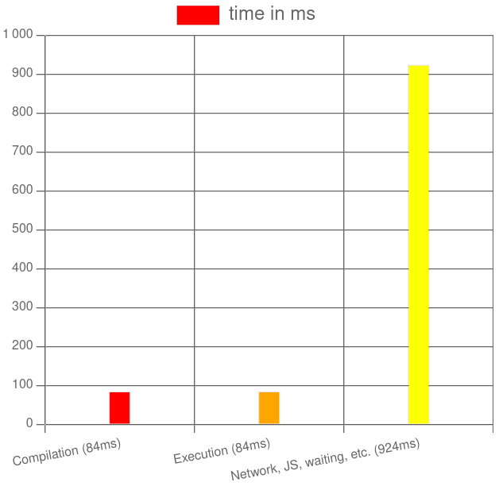

# Project Euler

My solutions to the euler project challenges (https://projecteuler.net) implemented in C++

### Table of Contents 
**[Challenge 1 : Multiples of 3 or 5](#multiples-of-3-or-5)** 
**[Challenge 2 : Even fibonacci numbers](#even-fibonacci-numbers)** 
**[Challenge 3 : Largest prime factor](#largest-prime-factor)** 

## Challenge 1 : Multiples of 3 or 5

### Description
If we list all the natural numbers below 10 that are multiples of 3 or 5, we get 3, 5, 6 and 9. 
The sum of these multiples is 23. 

Find the sum of all the multiples of 3 or 5 below 1000.

### Understanding 

The goal here is to compute the sum of all natural numbers below 1000 which are multiples of 3 or 5.
It is only mentionned 3 or 5 so it means that we should avoid numbers which are multiples of both like 15.

So if we compute the sum of numbers *only* multiple of 3 (S3), then those *only* multiple of 5(S5) and finally
the sum of numbers *only* multiple of 15 (S15) and then compute the *S = (S3+S5)-S15*, we should have the
expected value.

## Challenge 2 : Even fibonacci numbers

### Description

Each new term in the Fibonacci sequence is generated by adding the previous two terms. By starting with 1 and 2, the first 10 terms will be: 
1, 2, 3, 5, 8, 13, 21, 34, 55, 89, ... 
By considering the terms in the Fibonacci sequence whose values do not exceed four million, find the sum of the even-valued terms. 

### Understanding

For this one, we have to compute the Fibonacci numbers which are less than four million, 
for each one of them find out if they are even and if it is the case perform a summation. 

That's not so difficult, but the difficulty resides in the computation of Fibonacci numbers.  
Usually we use recursive function to do that. However, if we have to do that for all numbers,  
it will have a huge cost.

The first solution which came to my mind was to have a caching system so that as we are computing  
Fibonacci numbers, we may cache them along the way, so that the recursive function could use some  
cached values instead of always going to a recursive branch which may have been explored already  
for another computation.  

## Challenge 3 : Largest prime factor

### Description

The prime factors of 13195 are 5, 7, 13 and 29. 
What is the largest prime factor of the number 600851475143 ? 

### Understanding

This problem was quite interesting. So here the goal was to find out the largest prime number
which divided 600851475143. The first step for me was to find a method to have prime numbers
at my disposal. For that I was reminded about the [Sieve of Eratosthenes](https://en.wikipedia.org/wiki/Sieve_of_Eratosthenes).

To implement it I decided to use a template class because I was sure that I needed a large Array but how large was the question.
So for me having a configurable Sieve was key. The algorithm to implement it was not so difficult. But the big question
remained how to find out which was the largest prime factor.

I had to go back to the last schoolbook I have today, it was the one I used during my latest high school year.
In here, I was reminded about the prime factor decomposition also called [integer factorization](https://en.wikipedia.org/wiki/Integer_factorization).

This theory is that all natural numbers greater than 2 can be decomposed into product of prime factors.
An example is : 4872 = 2^3 x 3 x 7 x 29.

With this method in mind and my configurable Sieve of Eratosthenes, I had all the tools to implement the solution for the challenge 3.
Taking the number indicated and dividing it by all the prime factor in the order in which they are in the Eratosthenes table allowed
me to obtain the solution in a rather good amount of compilation and execution time.

## Challenge N : <Problem Title>

### Description
<Insert Description Here>
### Understanding
<Insert Understanding Here>
