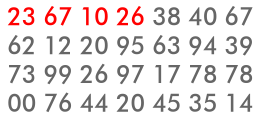

# Largest product in a grid

## Description

In the 20×20 grid below, four numbers along a diagonal line have been marked in red.

08 02 22 97 38 15 00 40 00 75 04 05 07 78 52 12 50 77 91 08

49 49 99 40 17 81 18 57 60 87 17 40 98 43 69 48 04 56 62 00

81 49 31 73 55 79 14 29 93 71 40 67 53 88 30 03 49 13 36 65

52 70 95 23 04 60 11 42 69 24 68 56 01 32 56 71 37 02 36 91

22 31 16 71 51 67 63 89 41 92 36 54 22 40 40 28 66 33 13 80

24 47 32 60 99 03 45 02 44 75 33 53 78 36 84 20 35 17 12 50

32 98 81 28 64 23 67 10 **26** 38 40 67 59 54 70 66 18 38 64 70

67 26 20 68 02 62 12 20 95 **63** 94 39 63 08 40 91 66 49 94 21

24 55 58 05 66 73 99 26 97 17 **78** 78 96 83 14 88 34 89 63 72

21 36 23 09 75 00 76 44 20 45 35 **14** 00 61 33 97 34 31 33 95

78 17 53 28 22 75 31 67 15 94 03 80 04 62 16 14 09 53 56 92

16 39 05 42 96 35 31 47 55 58 88 24 00 17 54 24 36 29 85 57

86 56 00 48 35 71 89 07 05 44 44 37 44 60 21 58 51 54 17 58

19 80 81 68 05 94 47 69 28 73 92 13 86 52 17 77 04 89 55 40

04 52 08 83 97 35 99 16 07 97 57 32 16 26 26 79 33 27 98 66

88 36 68 87 57 62 20 72 03 46 33 67 46 55 12 32 63 93 53 69

04 42 16 73 38 25 39 11 24 94 72 18 08 46 29 32 40 62 76 36

20 69 36 41 72 30 23 88 34 62 99 69 82 67 59 85 74 04 36 16

20 73 35 29 78 31 90 01 74 31 49 71 48 86 81 16 23 57 05 54

01 70 54 71 83 51 54 69 16 92 33 48 61 43 52 01 89 19 67 48


The product of these numbers is 26 × 63 × 78 × 14 = 1788696.

What is the greatest product of four adjacent numbers in the same direction (up, down, left, right, or diagonally) in the 20×20 grid?

## Understanding

Ok, this problem is very clear, the biggest challenge is on the logistic of it,
I mean how to actually perform the computation.

I have a pretty straightforward approach, we can go through all the numbers of the grid
and try to compute the product of the four adjacent direction.

If we can perform the computation we do it and use the result of the computation to compare it
with the maximum value.

If we cannot, we return 0.

We have in total 5 types of computation possible, and I'm going to show you for each configuration
what is going on.

For all the following examples, 26 is taken as the root element when performing the computation.

I will describe the coordinate of the root element as following : 
```c++
root {
    x, // -> the column index
    y  // -> the line index
};
```

### Right


For this configuration, we have to make sure that the index of the root element, respect the 
following requirement:

- element at [root.x+4-1,root.y] is inside the grid

$$ root.x + 4 < GRIDXLIMIT $$

The product will be equal to :

$$ P = [root.x,root.y]*[root.x+1,root.y]*[root.x+2,root.y]*[root.x+3,root.y] $$

### Diagonal


Here, the root element index should respect the following requirements:

- element at [root.x+4-1,root.y+4-1] is inside the grid

$$ root.x + 4 < GRIDXLIMIT $$

$$ root.x + 4 < GRIDYLIMIT $$

The product will be equal to

$$ P = [root.x,root.y]*[root.x+1,root.y+1]*[root.x+2,root.y+2]*[root.x+3,root.y+3] $$

### Down


Here, the root element index should respect the following requirement:

- element at [root.x,root.y+4-1] is inside the grid

$$ root.y + 4 < GRIDYLIMIT $$

The product will be equal to

$$ P = [root.x,root.y]*[root.x,root.y+1]*[root.x,root.y+2]*[root.x,root.y+3] $$

### Reverse-diagonal


Here, the root element index should respect the following requirement:

- element at [root.x-4+1,root.y+(4-1)] is inside the grid thus 

$$ root.x + 1 - 4 >= 0 $$

$$ root.y + 4 < GRIDYLIMIT $$

The product will be equal to

$$ P = [root.x,root.y]*[root.x-1,root.y+1]*[root.x-2,root.y+2]*[root.x-3,root.y+3] $$

### Left


Here, the root element index should respect the following requirement:

- element at [root.x-4+1,root.y] is inside the grid thus

$$ root.x + 1 - 4 >= 0 $$

The product will be equal to 

$$ P = [root.x,root.y]*[root.x-1,root.y]*[root.x-2,root.y]*[root.x-3,root.y] $$

### Solution

So as said earlier, we will go through all the numbers of the grid and try to perform all the mentioned
computation. After each computation we will compare the result with the max in order to determine the max. 

Basically this is the strategy for this problem.

In my implementation, I've used function pointer in order to loop through all the function pointer to compute
the maximum. Other methods could have worked, but I choose this one because it made the code simpler in my opinion.

## Benchmarking
